# AlertSphere: Disaster Tweet Detector

## Overview
AlertSphere is a machine learning-based system designed to predict whether a given tweet indicates a disaster. It utilizes natural language processing (NLP) techniques to analyze the text content of tweets and classify them as either disaster-related or not.

## Dataset
The dataset used for training and testing the AlertSphere model consists of nearly 7000 disaster-related tweets sourced from Kaggle. Each tweet is labeled with a binary target variable (1 for disaster, 0 for non-disaster).

Dataset Source: [Disaster Tweets Dataset] (https://drive.google.com/file/d/1eslDKi95Pg7BYZKcrXCXPP3KQj_pdnUd/view?usp=sharing)

### Sample Dataset:

| Tweets                                                                        | Target   | 
|-------------------------------------------------------------------------------|----------|
| Forest fire near La Ronge Sask. Canada	                                      | Yes      |
| You wrecked me. Never felt so low in my life. But it's okay God got me        | No       |
| #raining #flooding #Florida #TampaBay #Tampa 18 or 19 days. I've lost count   | Yes      |

### Dataset Analysis

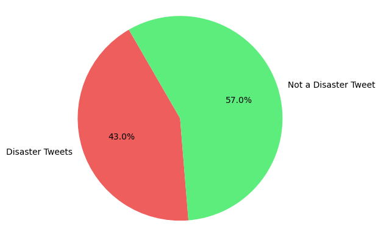 

"Based on the information provided by the pie chart, it appears that approximately 43% of the tweets in the dataset are related to disasters, while the remaining 57% are not. Given the relatively small difference between the proportions of disaster and non-disaster tweets, it suggests that there may not be a significant imbalance in the dataset. Therefore, there may be no immediate need for techniques such as undersampling or oversampling to address class imbalance."

## System Design

          +----------------------------------+
          |            Read Dataset          |
          +----------------------------------+
                     |
                     v
          +----------------------------------+
          |       Handle Null Values         |
          +----------------------------------+
                     |
                     v
          +----------------------------------+
          |       Data Preprocessing         |
          |       - Tokenization             |
          |       - Lowercasing              |
          |       - Punctuation Removal      |
          |       - Stopword Removal         |
          |       - Stemming/Lemmatization   |
          +----------------------------------+
                     |
                     v
          +----------------------------------+
          |   Transform Words into Vectors   |
          |   - Count Vectorizer             |
          |   - TF-IDF Vectorizer            |
          +----------------------------------+
                     |
                     v
          +----------------------------------+
          |   Select Features and Target     |
          +----------------------------------+
                     |
                     v
          +----------------------------------+
          |     Split Data into Training     |
          |           and Test Sets          |
          +----------------------------------+
                     |
                     v
          +----------------------------------+
          |     Model Training and Testing   |
          |  (Multinomial Naïve Bayes,       |
          |  Logistic Regression, KNN)       |
          +----------------------------------+
                     |
                     v
          +----------------------------------+
          |     Evaluate Model Accuracy      |
          |     If Low Accuracy, Revise Work |  
          +----------------------------------+
                     |
                     v
          +----------------------------------+
          |    Identify Best Model           |
          +----------------------------------+

## Models Result Analysis

### Multinomial Naïve Bayes Classification
#### Confusion Matrix & Classification Report
 

#### ROC Curve for Multinomial Naïve Bayes Classification
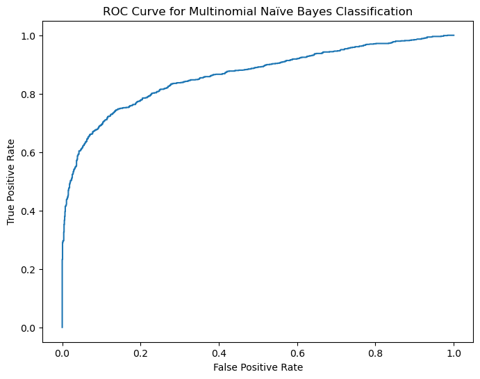

### Logistic Regression
#### Confusion Matrix & Classification Report
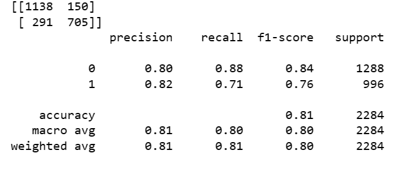 

#### ROC Curve for Logistic Regression

### KNN Classification
#### Confusion Matrix & Classification Report
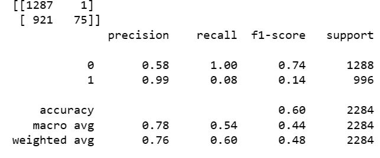 

#### ROC Curve for Multinomial Naïve Bayes Classification
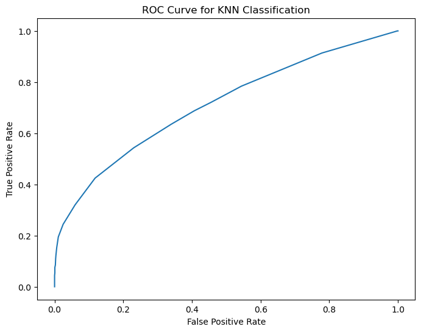

### Model Comparison
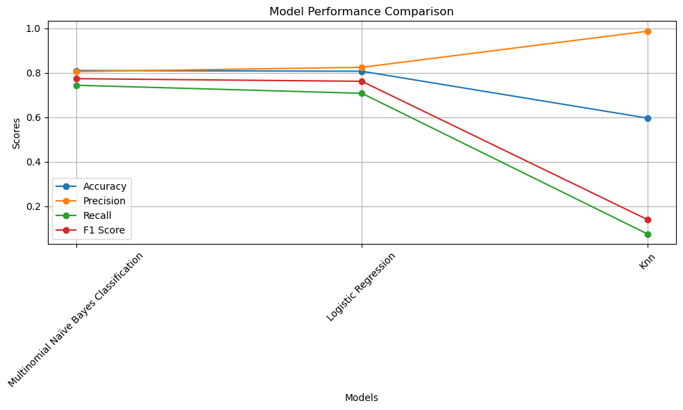

## Model Conclusion
"In conclusion, while evaluating the performance of our classification models, we observed that KNN Classification exhibited the lowest accuracy at 60%, prompting its exclusion from further consideration. Both Multinomial Naïve Bayes Classification and Logistic Regression demonstrated comparable accuracies of 81%. However, Logistic Regression displayed a notable disparity between its high train score of 97% and its slightly lower test score of 80%, indicating a potential risk of overfitting. Consequently, we opted to utilize Multinomial Naïve Bayes Classification due to its stable performance and absence of overfitting concerns."

| Algorithm               | Train Score | Test Score |
|-------------------------|-------------|------------|
| KNN                     | 61.89%      | 59.63%     |
| Logistics Regression    | 97.22%      | 80.69%     |
| MNB Classification      | 92.86%      | 81%        |

## User Interface
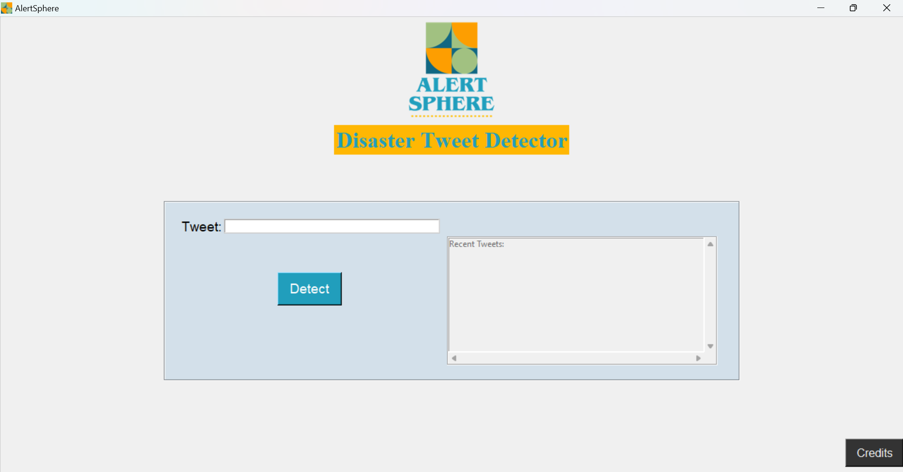
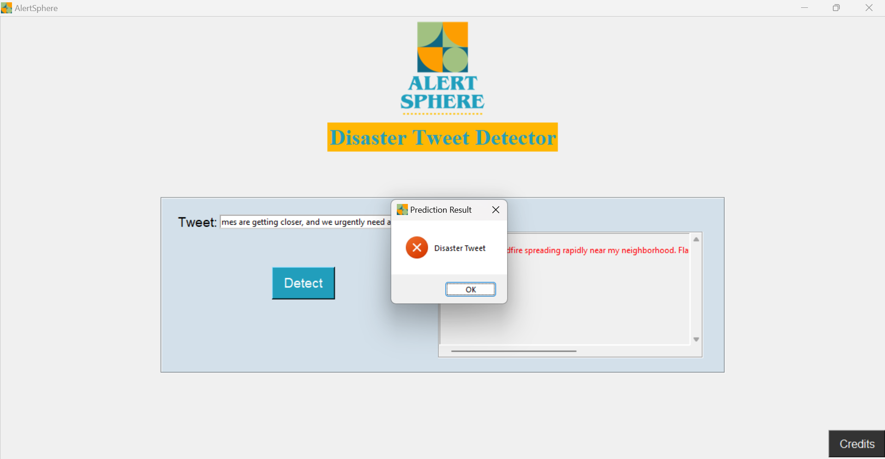
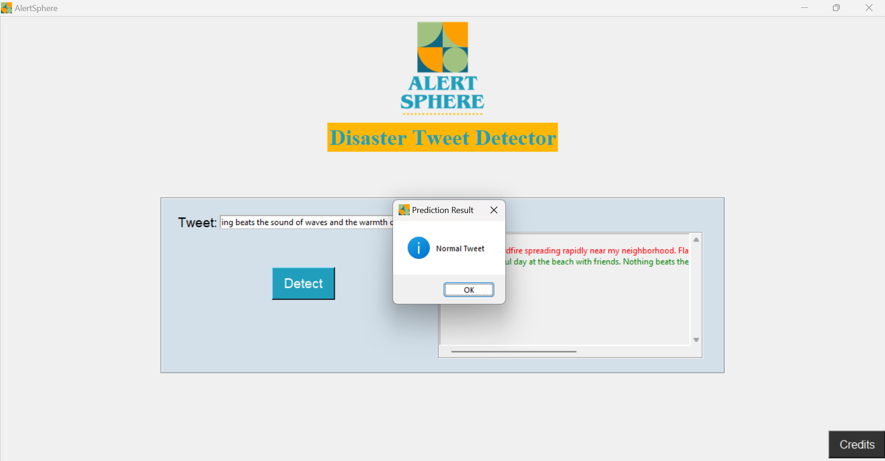
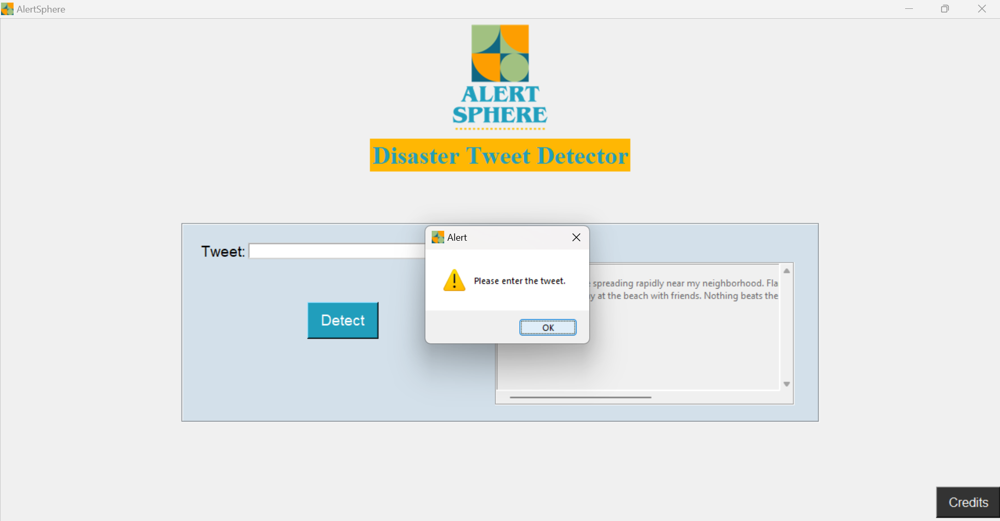
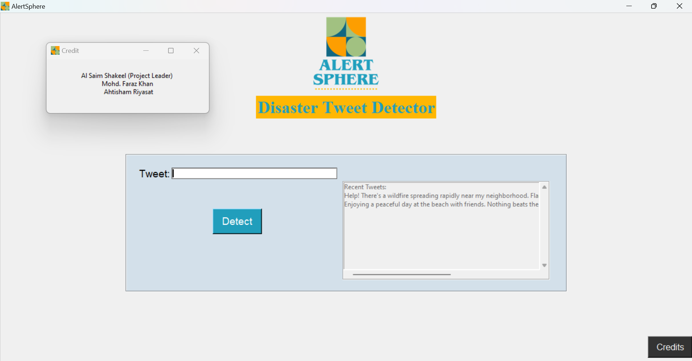

## Project Structure
- `README.md`: This file, providing an overview of the project.
- `alertsphere.ipynb`: Jupyter Notebook containing the code for data preprocessing, model training, and evaluation with User Interface build with Tkinter.
- `AlertSphere_frontend.py`: Python script containing the code for the front-end of the AlertSphere application.
- `requirements.txt`: Text file listing the dependencies required to run the code.
- `disaster_tweets_data(DS).xlsx`: Directory containing the dataset used in the project.
- `images/`: Directory containing various images used in the project, such as charts and visualizations.
- `alertsphere_model.pkl`: Pickled file containing the trained AlertSphere model.
- `count_vectorizer.pkl`: Pickled file containing the trained CountVectorizer used for text vectorization.
- `AlertSphere_PPT.pptx`: Directory containing the PowerPoint presentation slides (.ppt).
- `AlertSphere_Major_Project_Report.pdf`: PDF file containing the project report.
- `AlertSphere - Synopsis.pdf`: PDF document providing a brief overview of the AlertSphere project.
- `AlertSphere_Model_Code.pdf`: PDF document containing the code used to train the AlertSphere model.

## Installation
### Install the required modules:
- pandas: Data manipulation and analysis library in Python.
- scikit-learn: Machine learning library for building predictive models.
- matplotlib: Data visualization library for creating plots and charts.
- tkinter: GUI toolkit for building user interfaces in Python.
- nltk: Natural Language Toolkit for text processing tasks (e.g., stopwords).
- joblib: Library for saving and loading scikit-learn models.
- CountVectorizer: Scikit-learn module for converting text data into numerical vectors.
- LogisticRegression: Scikit-learn module for logistic regression classification.
- MultinomialNB: Scikit-learn module for multinomial Naive Bayes classification.
- KNeighborsClassifier: Scikit-learn module for K-nearest neighbors classification.

## Usage
1. Open and run the `alertsphere.ipynb` notebook using Jupyter Notebook or JupyterLab.
2. Follow the instructions and code cells in the notebook to preprocess the data, train the model, and evaluate its performance.
3. Use the trained model to make predictions on new tweet data or deploy it into a user interface for real-time prediction.
4. (Optional) If you prefer to use the built-in user interface (UI) with tkinter:
   - The UI with tkinter has already been built and integrated into the `alertsphere.ipynb` notebook.
   - Simply navigate to the relevant section in the notebook and execute the code cells to launch the UI.
   - Enter a tweet text into the UI and press the "Predict" button to see the prediction result.

## Dependencies
- Python: 3.11
- Anaconda Navigator: 2.4.2
- matplotlib: 3.7.0
- nltk: 3.7
- pandas: 1.5.3
- scikit-learn: 1.2.1
- joblib: 1.1.1
- tkinter (Built-in tkinter module used in Python, no specific version needed)

## Credits
- __[Al Saim Shakeel] : Project Leader__
- __[Mohd. Faraz Khan]__
- __[Ahtisham Riyasat]__

## Certificate

This project has been officially approved and certified by our Project Guide and the Head of Department (HOD) of the Computer Science Engineering department at Integral University, Lucknow.

[Approved Certificate](images/certificate.png)

## References
- [Python](https://www.python.org/): Python programming language.
- [Anaconda Navigator](https://www.anaconda.com/): Distribution platform that includes Python, R, and many popular packages for data science, machine learning, and scientific computing.
- [pandas](https://pandas.pydata.org/): Data manipulation and analysis library in Python.
- [scikit-learn](https://scikit-learn.org/): Machine learning library for building predictive models.
- [matplotlib](https://matplotlib.org/): Data visualization library for creating plots and charts.
- [nltk](https://www.nltk.org/): Natural Language Toolkit for text processing tasks.
- [joblib](https://joblib.readthedocs.io/en/latest/): Library for saving and loading scikit-learn models.
- [tkinter](https://docs.python.org/3/library/tkinter.html): Graphical User Interface (GUI) toolkit for Python.

# THE END